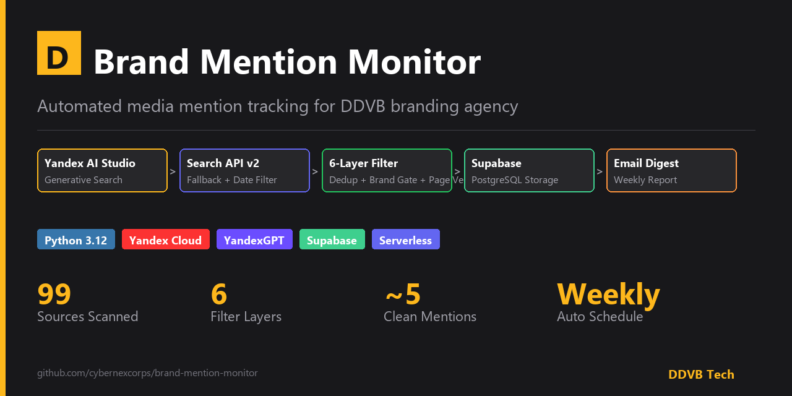

# Brand Mention Monitor




Automated brand mention tracking for DDVB branding agency. Discovers editorial mentions across Russian-language media using dual-source search, filters noise with a 6-layer pipeline, stores results in Supabase, and delivers a weekly email digest.

**Version:** 2.0 &nbsp;|&nbsp; **Runtime:** Yandex Cloud Functions &nbsp;|&nbsp; **Schedule:** Weekly &nbsp;|&nbsp; **Status:** Production

---

## What It Does

Answers one question every week: **"Where has DDVB been mentioned in Russian trade press and business media?"**

The monitor searches ~100 sources, filters them through 6 quality layers, and saves only verified editorial mentions — articles, case studies, rankings, and reviews that explicitly reference DDVB branding agency.

---

## Architecture

### Dual-Source Search

| Source | Method | Queries | Purpose |
|--------|--------|---------|---------|
| **Yandex AI Studio** | Generative search (SDK) | "DDVB" + "ДДВБ" | Primary — AI reads full pages, contextual filtering |
| **Yandex Search API v2** | Keyword search (async) | "DDVB" only | Fallback — breadth coverage, date-filtered, sorted by time |

### 6-Layer Filter Pipeline

```
99 raw results
  │
  ├── [L1] Dedup ────────────── URL normalization + DB cross-check
  ├── [L2] Blocklist + TLD ──── ~50 blocked domains + Russian TLD allowlist
  ├── [L3] Brand Gate ───────── "DDVB" must be in title/snippet text
  ├── [L4] Year Filter ──────── Reject pre-2026 from URL path / text
  ├── [L5] Page Verification ── Fetch URL, check DDVB exists on page
  └── [L6] AI Classifier ───── YandexGPT Lite binary relevance check
  │
  ~5 verified mentions → Supabase → Email digest
```

---

## Quick Start

```bash
# Install dependencies
pip install -r requirements.txt

# Set up credentials
cp .env.example .env
# Edit .env with your Yandex Cloud API key, Supabase credentials

# Dry run (no DB writes, no email)
python main.py --dry-run --verbose

# Full run
python main.py
```

---

## Deployment

Runs as a **Yandex Cloud Function** (Python 3.12), triggered weekly by a timer trigger. Deployment uses Object Storage (S3) for zip upload (>3.5MB).

```bash
# Build and deploy
cp *.py deploy/
cd deploy && zip -r ../function.zip . && cd ..
yc storage s3api put-object --bucket <bucket> --key function.zip --body function.zip
yc serverless function version create \
  --function-name brand-mention-monitor \
  --package-bucket-name <bucket> --package-object-name function.zip \
  --runtime python312 --entrypoint main.handler
```

See [docs/deployment.md](docs/deployment.md) for full instructions.

---

## Tech Stack

| Component | Technology |
|-----------|-----------|
| Primary Search | Yandex AI Studio SDK (generative search) |
| Fallback Search | Yandex Search API v2 (async + XML) |
| AI Classifier | YandexGPT Lite (OpenAI-compatible) |
| Database | Supabase (PostgreSQL) |
| Email | SMTP (STARTTLS) |
| Runtime | Yandex Cloud Functions (serverless) |
| Language | Python 3.12 |

---

## Documentation

| Document | Description |
|----------|-------------|
| [CLAUDE.md](CLAUDE.md) | Technical reference (authoritative) |
| [docs/architecture.md](docs/architecture.md) | System architecture and diagrams |
| [docs/api-reference.md](docs/api-reference.md) | Function signatures and behavior |
| [docs/configuration.md](docs/configuration.md) | Environment variables and constants |
| [docs/deployment.md](docs/deployment.md) | Step-by-step deployment guide |
| [docs/operations.md](docs/operations.md) | Monitoring and troubleshooting |
