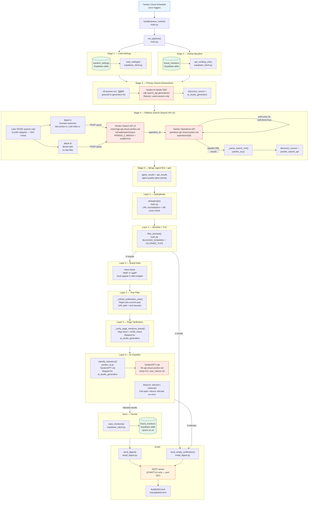
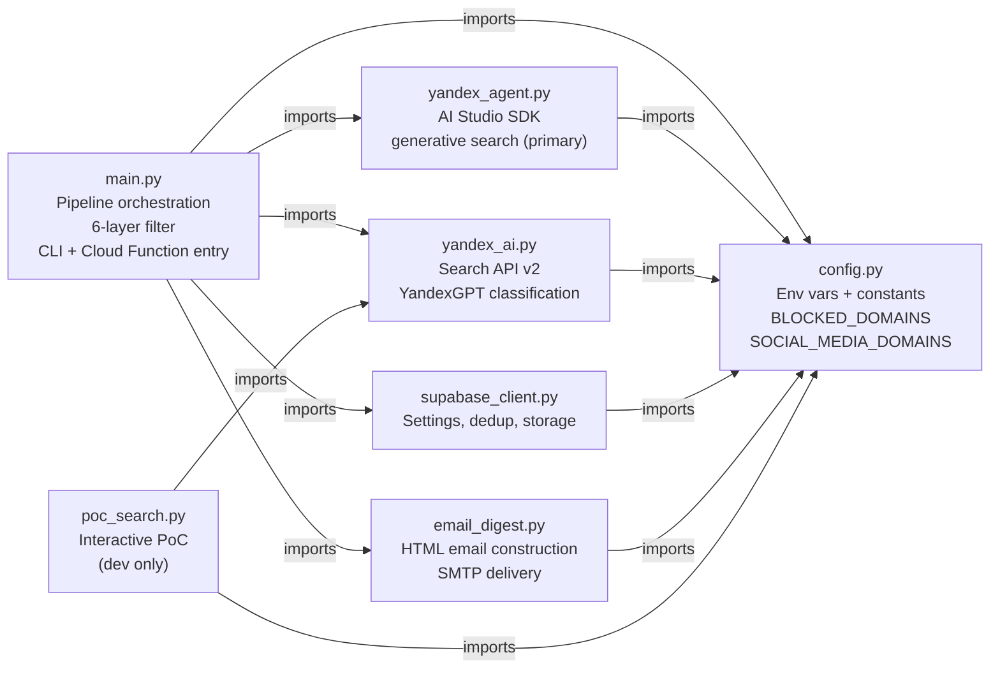
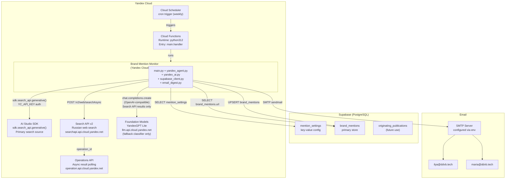
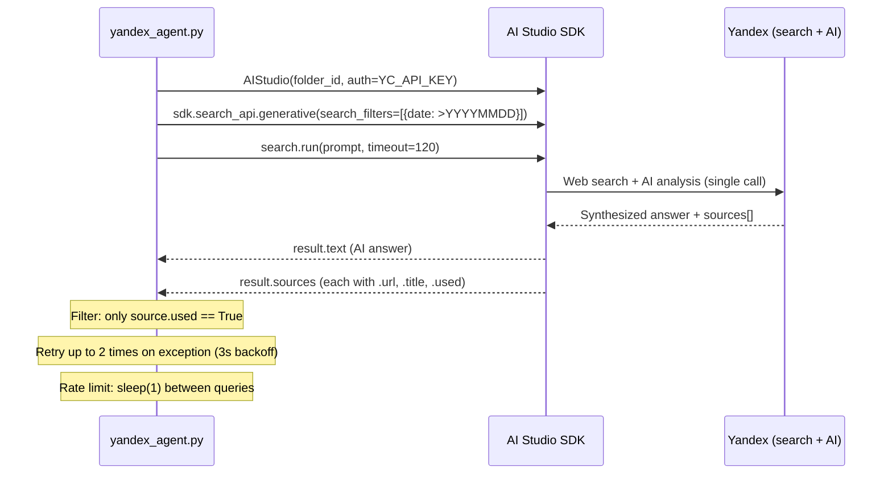
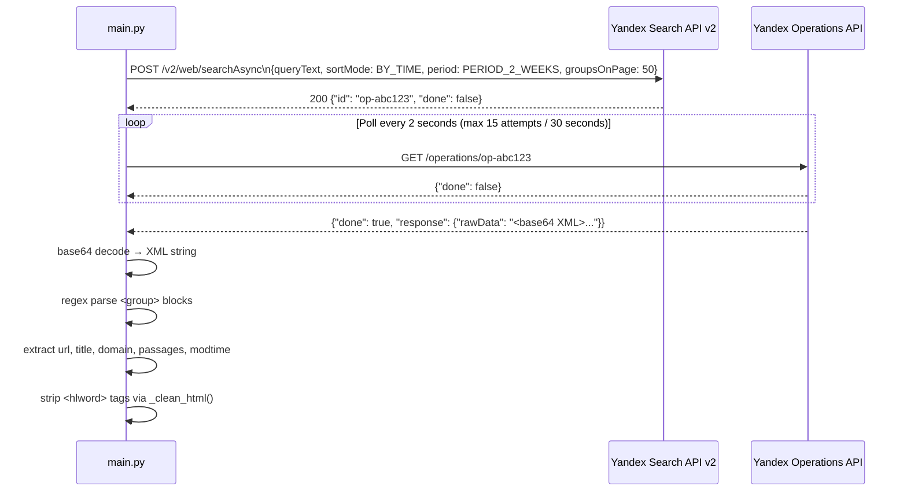

# Architecture — Brand Mention Monitor

## Overview

Brand Mention Monitor is a single-purpose Python service that runs on a schedule inside Yandex Cloud Functions. Each invocation executes a pipeline with two search stages and a six-layer filter: it discovers brand mentions using two complementary methods (Yandex AI Studio generative search and Yandex Search API v2), runs candidates through layered quality filters, classifies Search API results with YandexGPT, stores confirmed mentions in Supabase, and emails a formatted HTML digest to the team.

The service has no web server, no persistent process, and no message queue. It is entirely stateless at runtime — all persistence is delegated to Supabase, and all triggering is delegated to the Yandex Cloud scheduler.

---

## Full Pipeline Flow



---

## Module Dependency Map



`config.py` is the single shared configuration source. No module imports from another module except through `config.py` — there are no circular dependencies. `yandex_agent.py` is a new module added for the AI Studio generative search; it sits at the same level as `yandex_ai.py` and is imported independently by `main.py`.

### Module responsibilities

| File | Responsibility |
|---|---|
| `main.py` | Pipeline orchestration, 6-layer filter implementation, CLI entry point, Cloud Function handler |
| `config.py` | Environment variable loading, constants, `BLOCKED_DOMAINS` and `SOCIAL_MEDIA_DOMAINS` sets |
| `yandex_agent.py` | Yandex AI Studio SDK client — generative search (primary: search + contextual AI analysis in one call) |
| `yandex_ai.py` | Yandex Search API v2 (fallback: async search + XML parsing) and YandexGPT classifier/summarizer |
| `supabase_client.py` | Supabase reads (settings, existing URLs) and writes (upsert mentions with `summary` and `discovery_source` columns) |
| `email_digest.py` | HTML email construction and SMTP delivery (STARTTLS only) |
| `poc_search.py` | Interactive PoC script for manual validation (not used in production) |

---

## External Service Integrations



### Authentication summary

| Service | Auth method | Key |
|---|---|---|
| Yandex AI Studio SDK | `AIStudio(auth=YC_API_KEY)` SDK constructor | `YC_API_KEY` |
| Yandex Search API v2 | `Authorization: Api-Key {key}` header | `YC_API_KEY` |
| Yandex Operations API | Same `Api-Key` header via shared `httpx.Client` | `YC_API_KEY` |
| YandexGPT (OpenAI SDK) | `Authorization: Api-Key {key}` via `default_headers` | `YC_API_KEY` |
| Supabase | Service role key in `apikey` header (via SDK) | `SUPABASE_SERVICE_ROLE_KEY` |
| SMTP | Username/password `LOGIN` | `SMTP_USER` / `SMTP_PASSWORD` |

All three Yandex services use the same `YC_API_KEY`. The key must have IAM permissions for `search.yandex.net`, `llm.yandex.net`, and AI Studio generative search.

---

## Dual-Source Search Architecture

The pipeline uses two complementary search methods that run sequentially. Their results are merged before entering the filter pipeline, with generative search results placed first to take priority in deduplication.

### Primary — Yandex AI Studio Generative Search (`yandex_agent.py`)

Generative search combines web retrieval and AI analysis in a single call: the model searches Yandex, reads full page content, and returns an AI-synthesized answer with source URLs. This is the highest-quality source.

- Runs **all queries** including `"ДДВБ"` (Cyrillic). The AI model disambiguates brand context from automotive engine codes, which keyword-based search cannot do.
- Returns only `source.used == True` citations — sources the AI actually cited about DDVB, not tangential context.
- Results receive `discovery_source = "ai_studio_generative"` and **skip layers 5 and 6** (page verification and AI classifier), because the generative model already performed equivalent analysis when reading full page content.
- The `summary` field contains the first 200 characters of the AI-synthesized answer text.

### Fallback — Yandex Search API v2 (`yandex_ai.py`)

The Search API provides breadth coverage — it finds mentions the generative model may not surface, particularly on less prominent domains.

- Runs **Latin "DDVB" queries only**. Cyrillic "ДДВБ" is intentionally excluded from Search API (`main.py:176`) because it matches VAG engine codes and random Cyrillic sequences, producing noise that keyword-based search cannot filter contextually.
- Two-batch strategy: Batch A searches target domains via `site:` filter; Batch B searches the broad Russian web.
- Uses three simultaneous recency controls: `date:>YYYYMMDD` in query text, `SORT_MODE_BY_TIME` sort, and `PERIOD_2_WEEKS` native date filter.
- Results undergo all six filter layers.

---

## The 6-Layer Filter Pipeline

After merging, all results pass through six sequential layers. Agent-sourced results skip layers 5 and 6.

```
Raw results (agent + api, agent first)
    │
    ▼ [L1] deduplicate()
    │   URL normalization: strip trailing slash, query params, hash, www.
    │   Cross-check against in-session seen set + Supabase existing URLs
    │
    ▼ [L2] filter_blocked()
    │   Reject: BLOCKED_DOMAINS (~50 domains hardcoded in config.py)
    │   Reject: exclude_domains (runtime, from mention_settings)
    │   Reject: TLDs not in ALLOWED_TLDS (foreign TLD allowlist in main.py)
    │
    ▼ [L3] Brand gate (main.py:237-249)
    │   Hard check: "ddvb" or "ддвб" must appear literally in title + snippet
    │   Results without brand name in text are rejected regardless of AI
    │
    ▼ [L4] Year filter (_extract_publication_year(), main.py:47-65)
    │   Extract year from URL path patterns (/2026/03/) or title/snippet text
    │   Reject if extracted year < current year (fail-open if no year found)
    │
    ▼ [L5] Page verification (_verify_page_mentions_brand(), main.py:68-88)
    │   [SKIPPED for ai_studio_generative]
    │   Fetch URL via httpx (10s timeout, follow redirects)
    │   Reject if "ddvb" / "ддвб" not found in lowercased page HTML
    │   Fail-open on fetch errors (non-200, timeout, network)
    │
    ▼ [L6] AI classifier (classify_relevance(), yandex_ai.py)
    │   [SKIPPED for ai_studio_generative]
    │   YandexGPT Lite, temperature=0.0, max_tokens=10
    │   Returns "relevant" or "irrelevant"
    │   Fail-open on API error
    │
    ▼ Relevant mentions → save_mentions() + send_digest()
```

**Why layers 5 and 6 are skipped for generative search results:** The generative model reads full page content during retrieval and reasons about brand context in the same call. Running page verification or a second AI classifier on top would be redundant — the source has already performed stronger analysis than both layers provide.

---

## Data Flow Through the Pipeline

Each result travels as a plain Python `dict`. Fields are added or set at each stage:

```
After agent_search() — ai_studio_generative source:
{
    "url":              "https://sostav.ru/publication/ddvb-rebrand-2026.html",
    "title":            "DDVB провела ребрендинг для клиента",
    "domain":           "sostav.ru",
    "snippet":          "",                          # generative search has no snippet
    "summary":          "Агентство DDVB завершило...",  # AI answer text (≤200 chars)
    "relevance":        "relevant",                  # pre-set by generative model
    "discovery_query":  '"DDVB" (generative-search)',
    "discovery_source": "ai_studio_generative"
}

After search_web() + discovery annotation — yandex_search_api source:
{
    "url":              "https://retail.ru/news/ddvb-partner-2026.html",
    "title":            "DDVB стал партнёром ...",
    "domain":           "retail.ru",
    "snippet":          "Агентство DDVB объявило о партнёрстве...",
    "modtime":          "20260320",
    "discovery_query":  '"DDVB" (domain-restricted)',
    "discovery_source": "yandex_search_api"
}

After pipeline stages (setdefault calls in run_pipeline):
+ "summary":    snippet[:200]   # fallback for api source
+ "relevance":  "relevant"      # set by classify_relevance() or setdefault

Written to brand_mentions (save_mentions maps fields):
  url              ← url
  title            ← title
  snippet          ← snippet
  source_domain    ← domain
  discovery_query  ← discovery_query
  relevance_label  ← relevance   (always "relevant" at save time)
  discovery_source ← discovery_source  ("ai_studio_generative" or "yandex_search_api")
  summary          ← summary     (AI answer or snippet fallback)
```

---

## Yandex AI Studio Generative Search Pattern



---

## Yandex Search API v2 — Async Pattern



---

## Rate Limiting Architecture

All Yandex API calls in `run_pipeline()` are gated by a `YANDEX_RATE_LIMIT_SECONDS = 1.0` sleep. This applies to search calls (Search API) and LLM calls (YandexGPT classifier):

```
agent_search(queries)          → [internal sleep(1) per query in yandex_agent.py]
search_web(query, site_filter) → time.sleep(1.0)   # Batch A, per query
search_web(query)              → time.sleep(1.0)   # Batch B, per query
classify_relevance(...)        → time.sleep(1.0)   # per Search API result only
```

Note: generative search results skip the per-result classifier sleep because they bypass layer 6.

Each `search_web()` call can take up to 30 seconds for the async poll. Total runtime for a typical run:
- Generative search: ~2 queries × (up to 120s timeout + 1s sleep) = variable
- Search API: ~2 queries × 2 batches × (up to 32s poll + 1s sleep) = ~66s
- Classification: N Search API results × ~2s each

Expect 60–180 seconds per full run depending on result set size and API latency.

---

## Deployment Architecture

```
project root/
├── main.py              (source — edit here)
├── config.py            (source — edit here)
├── yandex_agent.py      (source — edit here)
├── yandex_ai.py         (source — edit here)
├── supabase_client.py   (source — edit here)
├── email_digest.py      (source — edit here)
├── requirements.txt
├── tests/
│   ├── test_dedup.py
│   ├── test_parsing.py
│   └── test_agent_parsing.py
├── deploy/              (production artifact — keep in sync with source)
│   ├── main.py          (copy of source)
│   ├── yandex_agent.py  (copy of source — required for generative search)
│   ├── yandex_ai.py     (copy of source)
│   ├── supabase_client.py (copy of source)
│   ├── email_digest.py  (copy of source)
│   ├── config.py        (copy of source — must be present before zipping)
│   └── deps/            (pre-installed Python packages)
│       ├── httpx/
│       ├── dotenv/
│       ├── yandex_ai_studio_sdk/
│       ├── ...
└── function.zip         (deploy/ zipped — exceeds 3.5MB, upload via Object Storage)
```

> The function.zip typically exceeds the Yandex Cloud Functions console upload limit of 3.5 MB because `deploy/deps/` contains compiled binary extensions (cryptography, cffi). Deployment uses Yandex Object Storage as an intermediary. See the Deployment Guide for details.

---

## Key Design Decisions

### Why dual-source search (generative + Search API)

The two sources are complementary in their failure modes. Generative search provides high-precision results — the AI reads full page content and reasons about brand context, suppressing automotive engine code matches and summarizing editorial content. The Search API provides breadth — it finds mentions on long-tail domains that the generative model may not surface. Running both ensures neither precision nor recall is sacrificed.

### Why "ДДВБ" runs in generative search only

The Cyrillic brand name generates massive noise in keyword-based search — "ДДВБ" matches VAG/Audi engine code records, random Cyrillic character sequences, and unrelated text fragments. The Search API has no mechanism to reason about whether a result is about a branding agency or an engine part. The generative AI model handles this disambiguation naturally through context understanding. This is why `main.py:176` explicitly filters out Cyrillic queries before passing them to `search_web()`.

### Why the 6-layer pipeline instead of a single AI pass

Each layer catches a specific failure mode that the other layers cannot:
- **L1 (dedup)** prevents double-processing of the same URL from different queries or runs.
- **L2 (blocklist + TLD)** eliminates entire categories of non-editorial domains with zero API cost.
- **L3 (brand gate)** is a zero-cost sanity check — if the brand name literally isn't in the text, no AI model will correctly classify it as a brand mention.
- **L4 (year filter)** removes stale content that passes all other checks, without an AI call.
- **L5 (page verification)** catches Yandex's context injection — snippets can contain "DDVB" as a keyword highlight even when the actual page does not mention the brand.
- **L6 (AI classifier)** handles semantic judgment — distinguishing editorial coverage from directory listings, aggregator pages, and sidebar mentions that pass all structural filters.

Running AI (L6) on everything without the preceding structural layers would waste quota on noise that cheap heuristics can eliminate. Running only structural filters without AI (L6) misses the semantic quality distinction between editorial coverage and low-value aggregators.

### Why YandexGPT for classification instead of keyword matching

Simple keyword presence produces high false-positive rates from WHOIS records, SEO analyzer reports, link directories, and social media aggregators — all of which contain "DDVB" without being editorial mentions. The LLM classifier distinguishes content type reliably with a tight binary prompt at `max_tokens=10` using the cheapest available model (YandexGPT Lite). The preceding structural layers (L1–L5) reduce the classifier's input to a small, high-quality candidate set, keeping the LLM call count low.

### Why the OpenAI SDK wraps YandexGPT

Yandex Cloud's LLM API is fully OpenAI-compatible. Using the OpenAI SDK avoids writing a custom HTTP client for LLM calls and inherits the SDK's connection pooling and error handling. The only differences from a standard OpenAI call are the `base_url`, the `Api-Key` auth header, and the model URI format (`gpt://{folder_id}/yandexgpt-lite/latest`).

### Why fail-open on page verification and classification errors

Both `_verify_page_mentions_brand()` and `classify_relevance()` return permissive values on failure (pass-through and `"relevant"` respectively). The cost of missing a genuine editorial mention outweighs the cost of one false positive that a human reviewer catches in the email digest.

### Why a hardcoded `BLOCKED_DOMAINS` set with ~50 entries

Blocked domains represent structural categories (DDVB's own domains, search engines, WHOIS/SEO tools, car parts sites, spam domains, and select visual platforms) that will never produce editorial mentions regardless of search query. These categories are stable. Making them configurable via the database would add operational complexity with no practical benefit. The `mention_settings` table controls parameters that legitimately change over time: which publications to target, which brand names to query.

### Why social media is NOT blanket-blocked

`t.me`, `vk.com`, `ok.ru`, and similar platforms are listed in `SOCIAL_MEDIA_DOMAINS` in `config.py` but are NOT added to `BLOCKED_DOMAINS`. Third-party editorial mentions published on Telegram channels or VK pages are legitimate brand coverage. These pass through layer 2 and are assessed by the generative AI or the YandexGPT classifier at layer 6.
